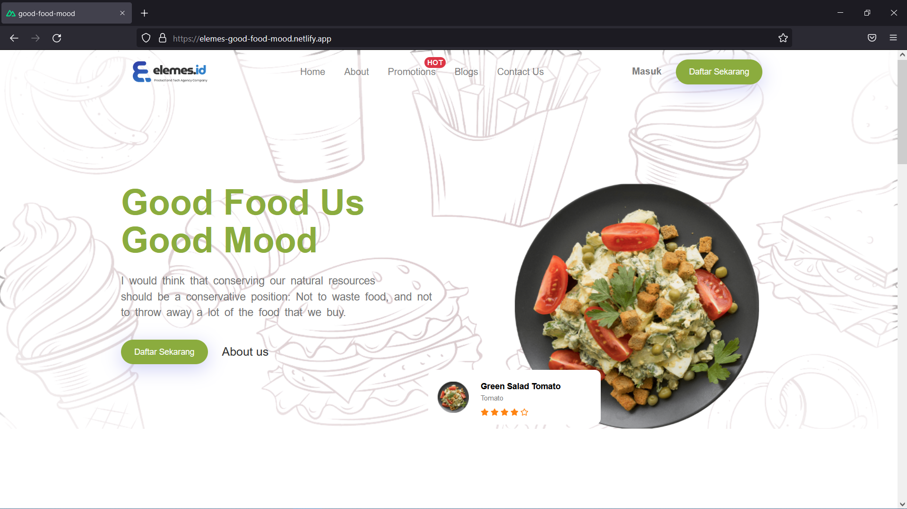
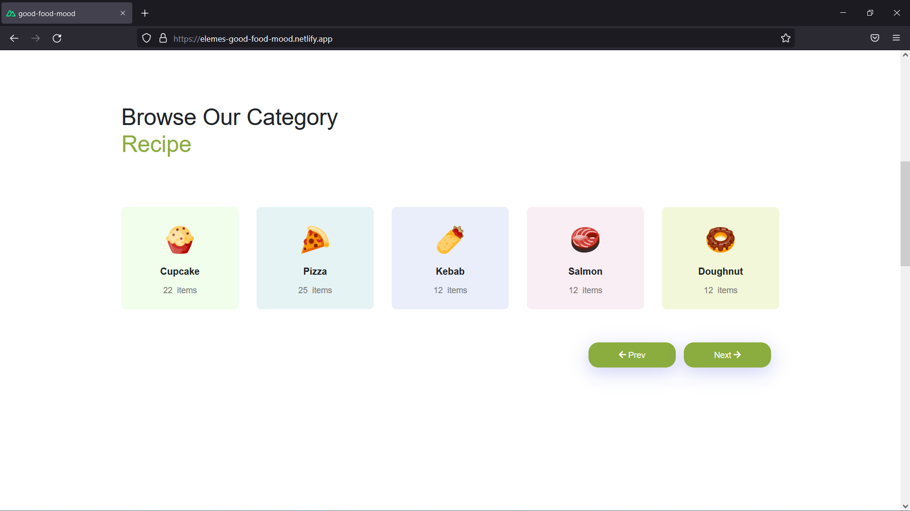

# Elemes Good-Food-Mood
Built with Nuxt js & Bootstrap
  <p align="center">
    
  </p> 

## Workflow

Here's workflow when building this website

```bash
# creating nuxt app
$ npx create-nuxt-app good-mood

# setup packages, styling & code the components and pages and deploy to Netlify

# serve with hot reload at localhost:3000
$ npm run dev
```
## Build Setup

```bash
# install dependencies
$ npm install

# serve with hot reload at localhost:3000
$ npm run dev

# build for production and launch server
$ npm run build
$ npm run start

# generate static project
$ npm run generate
```

For detailed explanation on how things work, check out the [documentation](https://nuxtjs.org).


## Netlify Deploy CLI

```bash
# login to netlify
$ netlify login

# Create & configure a new site

# Deploy Production
$ netlify deploy --prod

# Set publish directory

```
More information about the usage of this directory in [the documentation](https://docs.netlify.com/cli/get-started/#get-started-with-netlify-dev).


## Obstacle

I've problem with carousel cards and some responsive items.

  <p align="center">
    
  </p> 

## Solution
 I've to learn a lot more and in the future can be better and faster.


## For Elemes.Id Web
I think elemes id need more spacing for the products to read clearly.

## Thanks for the challenge
 Fadillah Aulia Rahman
